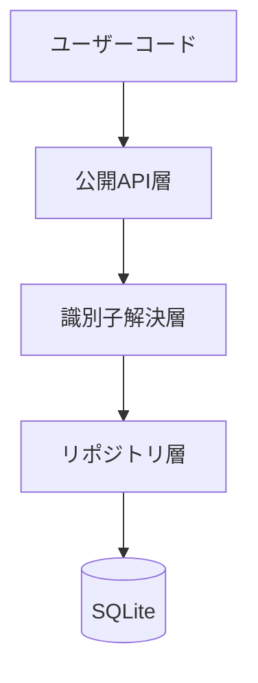
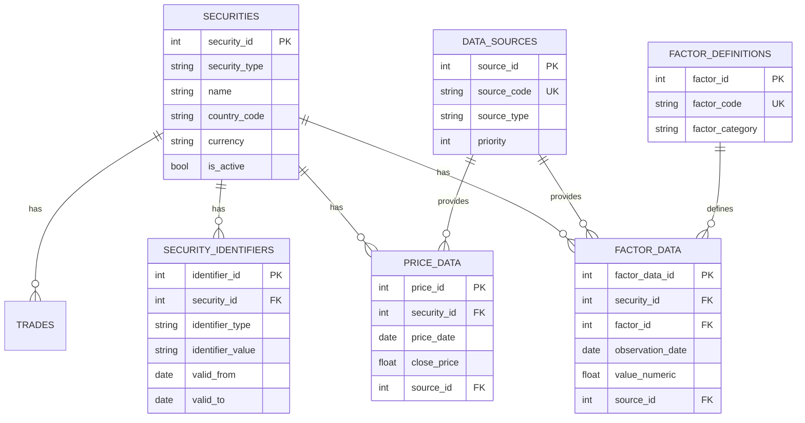
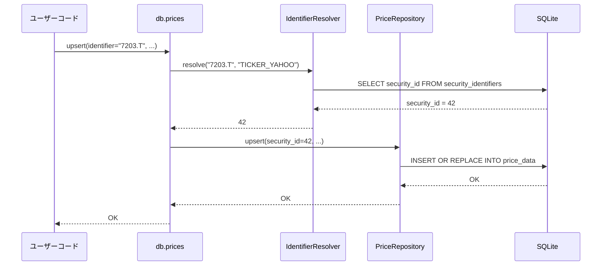
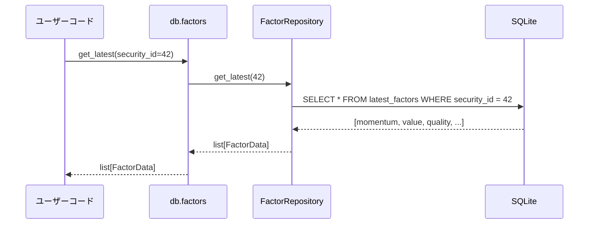
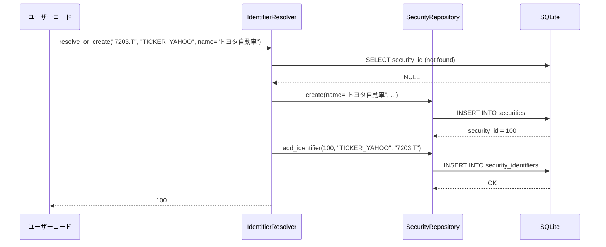

# 機能設計書 (Functional Design Document)

## システム構成図



## 技術スタック

| 分類 | 技術 | 選定理由 |
|------|------|----------|
| 言語 | Python 3.12 | 型ヒント改善、パターンマッチング |
| データベース | SQLite | 軽量、組み込み、ファイルベース |
| パッケージ管理 | uv | 高速、統合されたツール |
| リント・フォーマット | Ruff | 高速、多機能 |
| 型チェック | pyright | 厳密な型チェック |
| テスト | pytest + Hypothesis | 標準的、プロパティベーステスト |
| ロギング | structlog | 構造化ログ |

## データモデル定義

### エンティティ: Security（銘柄マスタ）

```python
from dataclasses import dataclass
from datetime import datetime

@dataclass(frozen=True, slots=True)
class Security:
    security_id: int           # 内部ID（自動採番）
    security_type: str         # equity, etf, bond, fund, etc.
    name: str                  # 銘柄名
    name_local: str | None     # ローカル名（日本語等）
    country_code: str          # 国コード（2文字）
    currency: str              # 通貨コード（3文字）
    exchange_code: str | None  # 取引所コード
    is_active: bool            # アクティブフラグ
    created_at: datetime       # 作成日時
    updated_at: datetime       # 更新日時
```

**制約**:
- security_id: 主キー、自動採番
- security_type: enum制約 (equity, etf, bond, fund, derivative, currency, index, other)
- country_code: 2文字
- currency: 3文字

### エンティティ: SecurityIdentifier（識別子マッピング）

```python
@dataclass(frozen=True, slots=True)
class SecurityIdentifier:
    identifier_id: int         # 主キー
    security_id: int           # 銘柄ID（外部キー）
    identifier_type: str       # ISIN, CUSIP, SEDOL, TICKER_YAHOO, etc.
    identifier_value: str      # 識別子の値
    valid_from: date           # 有効開始日
    valid_to: date | None      # 有効終了日（NULLは現在有効）
    is_primary: bool           # プライマリフラグ
```

**制約**:
- (security_id, identifier_type, valid_from) でユニーク
- valid_to IS NULL の場合、現在有効

### エンティティ: DataSource（データソース）

```python
@dataclass(frozen=True, slots=True)
class DataSource:
    source_id: int             # 主キー
    source_code: str           # YAHOO, BLOOMBERG, EXCEL, MANUAL
    source_name: str           # 表示名
    source_type: str           # api, file, manual, derived
    identifier_type_preferred: str | None  # このソースが使用する識別子タイプ
    priority: int              # 優先度（低い値が高優先）
    is_active: bool            # アクティブフラグ
```

### エンティティ: PriceData（価格データ）

```python
@dataclass(frozen=True, slots=True)
class PriceData:
    price_id: int              # 主キー
    security_id: int           # 銘柄ID（外部キー）
    price_date: date           # 日付
    open_price: float | None   # 始値
    high_price: float | None   # 高値
    low_price: float | None    # 安値
    close_price: float         # 終値
    adjusted_close: float | None  # 調整後終値
    volume: int | None         # 出来高
    source_id: int             # データソースID（外部キー）
    fetch_timestamp: datetime  # 取得日時
```

**制約**:
- (security_id, price_date, source_id) でユニーク

### エンティティ: FactorDefinition（ファクター定義）

```python
@dataclass(frozen=True, slots=True)
class FactorDefinition:
    factor_id: int             # 主キー
    factor_code: str           # momentum_20d, pe_ratio, etc.
    factor_name: str           # 表示名
    factor_category: str       # momentum, value, quality, volatility
    data_type: str             # numeric, text, boolean
    unit: str | None           # ratio, percentage, currency
    description: str | None    # 説明
    calculation_notes: str | None  # 計算式メモ
```

### エンティティ: FactorData（ファクター値）

```python
@dataclass(frozen=True, slots=True)
class FactorData:
    factor_data_id: int        # 主キー
    security_id: int           # 銘柄ID
    factor_id: int             # ファクターID
    observation_date: date     # 観測日
    value_numeric: float | None  # 数値
    value_text: str | None     # テキスト値
    source_id: int             # データソースID
    fetch_timestamp: datetime  # 取得日時
```

**制約**:
- (security_id, factor_id, observation_date, source_id) でユニーク

### ER図



## コンポーネント設計

### DatabaseConnection

**責務**:
- SQLiteへの接続管理
- トランザクション管理（コミット/ロールバック）
- コンテキストマネージャとしての動作

**インターフェース**:
```python
from contextlib import contextmanager
from pathlib import Path
from typing import Iterator
import sqlite3

class DatabaseConnection:
    def __init__(self, db_path: Path | str) -> None: ...
    def connect(self) -> sqlite3.Connection: ...
    @contextmanager
    def transaction(self) -> Iterator[sqlite3.Connection]: ...
    def close(self) -> None: ...
    def __enter__(self) -> "DatabaseConnection": ...
    def __exit__(self, *args) -> None: ...
```

### IdentifierResolver

**責務**:
- 外部識別子から内部IDへの解決
- 識別子タイプの自動検出
- ポイントインタイム（時点指定）での解決

**インターフェース**:
```python
from datetime import date

class IdentifierResolver:
    def __init__(self, connection: DatabaseConnection) -> None: ...

    def resolve(
        self,
        identifier_value: str,
        identifier_type: str,
        as_of: date | None = None,
    ) -> int | None:
        """外部識別子を内部IDに解決"""
        ...

    def resolve_auto(
        self,
        identifier_value: str,
        as_of: date | None = None,
    ) -> int | None:
        """識別子タイプを自動検出して解決"""
        ...

    def resolve_or_create(
        self,
        identifier_value: str,
        identifier_type: str,
        security_name: str | None = None,
        **kwargs,
    ) -> int:
        """解決できなければ新規作成"""
        ...
```

### SecurityRepository

**責務**:
- 銘柄マスタのCRUD
- 識別子の登録・更新
- 銘柄検索

**インターフェース**:
```python
class SecurityRepository:
    def create(
        self,
        name: str,
        security_type: str = "equity",
        country_code: str = "JP",
        currency: str = "JPY",
        **kwargs,
    ) -> int:
        """銘柄を作成し、内部IDを返す"""
        ...

    def get(self, security_id: int) -> Security | None: ...
    def get_identifiers(self, security_id: int) -> list[SecurityIdentifier]: ...
    def add_identifier(
        self,
        security_id: int,
        identifier_type: str,
        identifier_value: str,
        valid_from: date | None = None,
    ) -> None: ...
```

### PriceRepository

**責務**:
- 価格データのCRUD
- upsert処理
- ベストデータの取得（優先度ベース）

**インターフェース**:
```python
class PriceRepository:
    def upsert(
        self,
        security_id: int,
        price_date: date,
        close_price: float,
        source_id: int,
        open_price: float | None = None,
        high_price: float | None = None,
        low_price: float | None = None,
        volume: int | None = None,
        adjusted_close: float | None = None,
    ) -> None: ...

    def get(
        self,
        security_id: int,
        start_date: date | None = None,
        end_date: date | None = None,
        source_id: int | None = None,
    ) -> list[PriceData]: ...

    def get_best(
        self,
        security_id: int,
        start_date: date | None = None,
        end_date: date | None = None,
    ) -> list[PriceData]:
        """優先度が最も高いソースのデータを取得"""
        ...
```

### FactorRepository

**責務**:
- ファクター定義のCRUD
- ファクター値のCRUD
- 最新値・カテゴリ別取得

**インターフェース**:
```python
class FactorRepository:
    def define(
        self,
        factor_code: str,
        factor_name: str,
        factor_category: str,
        data_type: str = "numeric",
        description: str | None = None,
    ) -> int: ...

    def upsert_value(
        self,
        security_id: int,
        factor_id: int,
        observation_date: date,
        source_id: int,
        value_numeric: float | None = None,
        value_text: str | None = None,
    ) -> None: ...

    def get_latest(
        self,
        security_id: int,
        factor_ids: list[int] | None = None,
    ) -> list[FactorData]: ...

    def get_by_category(
        self,
        security_id: int,
        category: str,
        observation_date: date | None = None,
    ) -> list[FactorData]: ...
```

## ユースケース図

### UC1: 株価データの保存（外部識別子使用）



**フロー説明**:
1. ユーザーがYahoo ticker（7203.T）で株価を保存
2. IdentifierResolverがtickerを内部IDに解決
3. PriceRepositoryがデータを保存（既存なら更新）

### UC2: ファクター値の取得（複数ソース統合）



### UC3: 新規銘柄の登録（識別子付き）



## パフォーマンス最適化

- **WALモード**: SQLiteのWrite-Ahead Loggingを有効化し、読み書きの並行性を向上
- **インデックス**: 頻繁に検索される列（identifier_type + identifier_value、security_id + date）にインデックス
- **バッチ挿入**: executemanyを使用した一括挿入
- **接続再利用**: 1セッション内で接続を再利用

## セキュリティ考慮事項

- **SQLインジェクション対策**: パラメータ化クエリのみ使用（文字列結合禁止）
- **ファイルパス検証**: データベースパスの正規化とバリデーション
- **外部キー制約**: 参照整合性の強制

## エラーハンドリング

### エラーの分類

| エラー種別 | 例外クラス | ユーザーへの表示 |
|-----------|-----------|-----------------|
| 接続エラー | ConnectionError | "データベースに接続できません: {path}" |
| 識別子未解決 | IdentifierNotFoundError | "銘柄が見つかりません: {identifier}" |
| 重複エラー | DuplicateError | "既に存在します: {entity}" |
| バリデーションエラー | ValidationError | "入力値が不正です: {field}: {reason}" |

### カスタム例外

```python
class DatabaseUtilsError(Exception):
    """ベース例外"""
    pass

class IdentifierNotFoundError(DatabaseUtilsError):
    """識別子が見つからない"""
    def __init__(self, identifier_type: str, identifier_value: str) -> None:
        self.identifier_type = identifier_type
        self.identifier_value = identifier_value
        super().__init__(f"Security not found: {identifier_type}={identifier_value}")

class DuplicateSecurityError(DatabaseUtilsError):
    """銘柄が重複"""
    pass
```

## テスト戦略

### ユニットテスト
- IdentifierResolver: 各識別子タイプの解決ロジック
- 自動タイプ検出: ISIN、JP_CODE等のパターンマッチング
- バリデーション: 入力値の検証

### 統合テスト
- 銘柄作成→識別子追加→価格保存→取得の一連フロー
- 複数ソースからのデータ保存と優先度ベース取得
- トランザクションのコミット/ロールバック

### プロパティベーステスト（Hypothesis）
- 任意の識別子値での解決・作成サイクル
- 日付範囲クエリの境界条件
