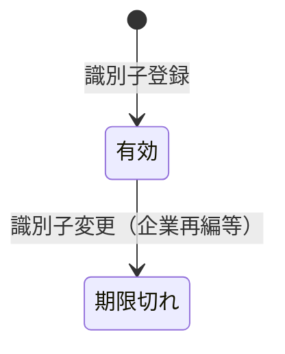

# プロジェクト用語集 (Glossary)

## 概要

このドキュメントは、database-utilsプロジェクトで使用される用語の定義を管理します。

**更新日**: 2025-12-31

## ドメイン用語

### Security（銘柄）

**定義**: 株式、ETF、債券などの金融商品を表すエンティティ

**説明**: 内部ID（security_id）で一意に識別される。複数の外部識別子（ISIN, ticker等）を持つことができる。

**関連用語**: SecurityId, Identifier

**使用例**:
- "トヨタ自動車" は1つのSecurityとして管理される
- 同一Securityに対して、"7203"（証券コード）と"7203.T"（Yahoo ticker）の両方が登録できる

**英語表記**: Security

### Identifier（識別子）

**定義**: 銘柄を識別するための外部コード

**説明**: ISIN, CUSIP, SEDOLなど、データ提供元やシステムによって異なるコード体系がある。

**関連用語**: Security, IdentifierType

**使用例**:
- ISIN: "JP3633400001"（トヨタ自動車）
- Yahoo ticker: "7203.T"
- Bloomberg ticker: "7203 JP Equity"

**英語表記**: Identifier

### Factor（ファクター）

**定義**: 銘柄の特性を数値化した指標

**説明**: モメンタム、バリュー、クオリティなどのカテゴリに分類される投資ファクター。

**関連用語**: Feature, FactorCategory

**使用例**:
- momentum_20d: 過去20日間のリターン
- pe_ratio: 株価収益率
- roe: 自己資本利益率

**英語表記**: Factor

### Data Source（データソース）

**定義**: データの取得元・提供元

**説明**: yfinance, Excel, Bloomberg等。各ソースには優先度が設定され、データ競合時の解決に使用される。

**関連用語**: DataLineage, Priority

**使用例**:
- "YAHOO": yfinanceからの株価データ
- "EXCEL_IMPORT": Excelファイルからインポートした財務データ
- "MANUAL": 手動入力データ

**英語表記**: Data Source

## 技術用語

### SQLite

**定義**: 軽量な組み込みリレーショナルデータベース

**公式サイト**: https://sqlite.org/

**本プロジェクトでの用途**: 銘柄マスタ、価格データ、ファクターデータの永続化

**バージョン**: 3.35+

### structlog

**定義**: Python用の構造化ロギングライブラリ

**公式サイト**: https://www.structlog.org/

**本プロジェクトでの用途**: コンテキスト付きログ出力、JSON形式でのログ保存

**バージョン**: >=25.4.0

### uv

**定義**: Rustで書かれた高速なPythonパッケージマネージャ

**公式サイト**: https://github.com/astral-sh/uv

**本プロジェクトでの用途**: 依存関係管理、仮想環境管理

**バージョン**: latest

## 略語・頭字語

### ISIN

**正式名称**: International Securities Identification Number

**意味**: 国際的に統一された証券識別コード（12文字）

**本プロジェクトでの使用**: identifier_typeの1つとして使用

### CUSIP

**正式名称**: Committee on Uniform Securities Identification Procedures

**意味**: 北米で使用される証券識別コード（9文字）

**本プロジェクトでの使用**: identifier_typeの1つとして使用

### SEDOL

**正式名称**: Stock Exchange Daily Official List

**意味**: 英国で使用される証券識別コード（7文字）

**本プロジェクトでの使用**: identifier_typeの1つとして使用

### FIGI

**正式名称**: Financial Instrument Global Identifier

**意味**: Bloombergが管理するグローバル識別子

**本プロジェクトでの使用**: identifier_typeの1つとして使用

### OHLCV

**正式名称**: Open, High, Low, Close, Volume

**意味**: 株価の基本データ（始値、高値、安値、終値、出来高）

**本プロジェクトでの使用**: price_dataテーブルのカラム構成

### WAL

**正式名称**: Write-Ahead Logging

**意味**: SQLiteのジャーナルモードの一種

**本プロジェクトでの使用**: パフォーマンス最適化のため有効化

## アーキテクチャ用語

### Repository Pattern（リポジトリパターン）

**定義**: データアクセスロジックをビジネスロジックから分離するデザインパターン

**本プロジェクトでの適用**: SecurityRepository, PriceRepository, FactorRepository等

**関連コンポーネント**: core/repositories/

### Identifier Resolution（識別子解決）

**定義**: 外部識別子から内部IDへの変換プロセス

**本プロジェクトでの適用**: IdentifierResolverクラスが担当

**図解**:
```
外部識別子 ("7203.T")
    ↓ resolve()
security_identifiersテーブル検索
    ↓
内部ID (42)
```

### Data Lineage（データリネージ）

**定義**: データの来歴・出自の追跡

**本プロジェクトでの適用**: 全データにsource_idを付与し、どのソースから取得したか追跡可能

## ステータス・状態

### 識別子の有効性

| ステータス | 意味 | 判定条件 |
|----------|------|---------|
| 有効 | 現在使用可能 | valid_to IS NULL |
| 期限切れ | 過去に有効だった | valid_to < 現在日 |

**状態遷移図**:


## データモデル用語

### SecurityId

**定義**: 銘柄の内部識別子

**型**: int（正の整数）

**特徴**: 自動採番、外部には公開しない

### ExternalIdentifier

**定義**: 外部識別子を表すデータ構造

**主要フィールド**:
- `identifier_type`: 識別子タイプ（ISIN, CUSIP等）
- `value`: 識別子の値

## エラー・例外

### IdentifierNotFoundError

**クラス名**: `IdentifierNotFoundError`

**発生条件**: 指定された識別子が登録されていない場合

**対処方法**:
- 識別子の値・タイプを確認
- `resolve_or_create()` を使用して自動登録

**例**:
```python
raise IdentifierNotFoundError(
    identifier_type="JP_CODE",
    identifier_value="9999"
)
```

### DuplicateSecurityError

**クラス名**: `DuplicateSecurityError`

**発生条件**: 同一の識別子で異なる銘柄を登録しようとした場合

**対処方法**:
- 既存の銘柄を確認
- 必要に応じて識別子を更新

### ValidationError

**クラス名**: `ValidationError`

**発生条件**: 入力値が不正な場合

**対処方法**: エラーメッセージに従って入力を修正

## 計算・アルゴリズム

### 優先度ベースのデータ選択

**定義**: 複数ソースから同一データがある場合に、優先度が高いソースを選択

**計算式**:
```sql
SELECT * FROM price_data p
JOIN data_sources ds ON p.source_id = ds.source_id
WHERE (security_id, price_date, ds.priority) IN (
    SELECT security_id, price_date, MIN(priority)
    FROM ...
    GROUP BY security_id, price_date
)
```

**実装箇所**: `src/database_utils/core/schema.py` (best_prices ビュー)

### 識別子タイプ自動検出

**定義**: 識別子の文字列パターンからタイプを推測

**ルール**:
- 12文字 + 先頭2文字がアルファベット → ISIN
- 4文字 + 全て数字 → JP_CODE
- "BBG" で始まる12文字 → FIGI

**実装箇所**: `src/database_utils/core/identifier.py`
